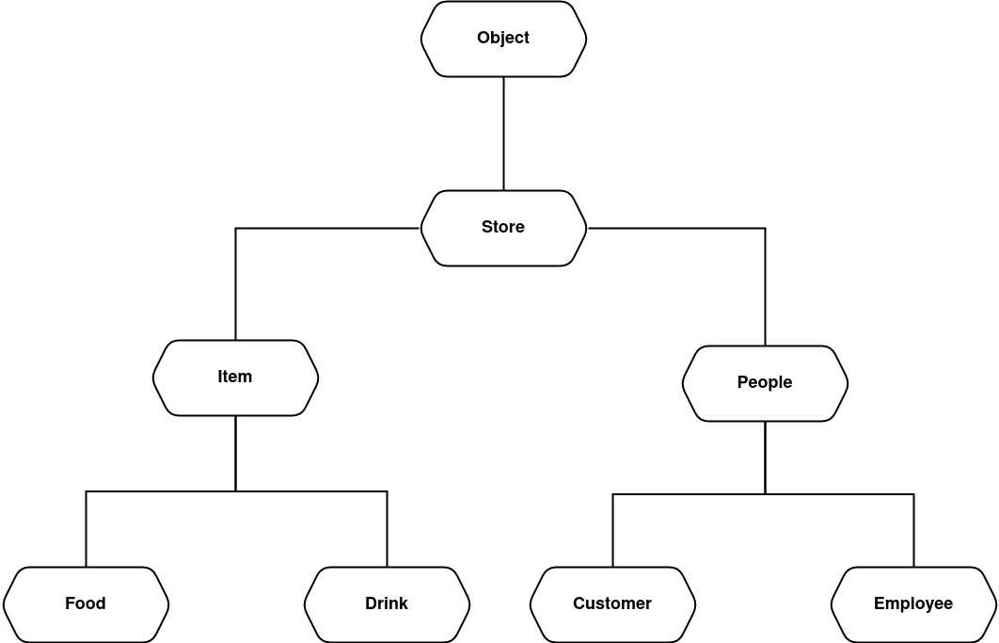

*Lab 3, OOP*

# Store Simulation

Declared Classes:
* Object
* Store
* People
* Customer
* Employee
* Item
* Food
* Drink

## Hierarchy Diagram

  

## Diagram Description
The superclass I created is called *Obejct*, it has only the property 'name'. From it all other classes will be created. The next child class is *Store*. It has the attribute 'Date' that will have different meanings based on the next child class. For the store, the sense is the opening date. The class *Store* has two child classes: *Item* and *People*.  

Now, the class *Item* has one main property called 'price'. This class has also two child classes that are *Food* and *Drink*. Class *Food* has attribute 'mass' and class *Drink* has 'volume'. This classes inherit from the parent class *Store* the 'date' property that describes the manufacturing date.

Going back to the class *Store*, it has another child class called *People*. Class *People* have attributes like 'lastname', 'age'. For them the inherited property date means the birth date. This class has also two child: customer and employee. The customer has a balance, but employees have worked age and a role.

## Class Description 
Class *Object*   

                 - helps to read child classes data
Class *Store*    
                 
                 - welcomes customers
                 - announce customer position
Class *People*   
                 
                 - say Hi
Class *Customer* 
                 
                 - take items
                 - pay for items
                 - check balance
                 - show cheque
Class *Employee* 
                 
                 - introduce what they do
                 - receive payment
                 - give cheque
                 - control cheque
Class *Item*     
                  
                 - can be bought
Class *Food*    
                 
                 - description tag
Class *Drink*    
                  
                 - description tag
